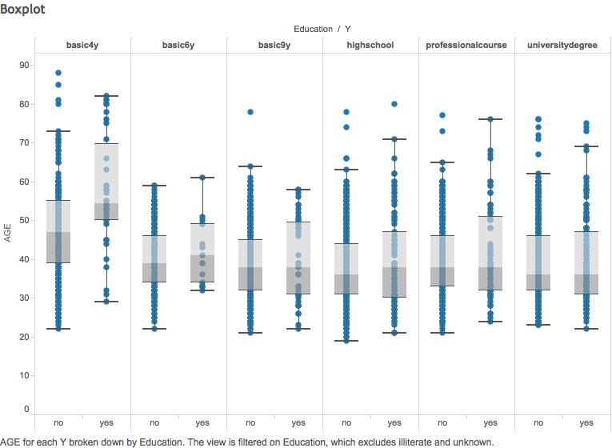
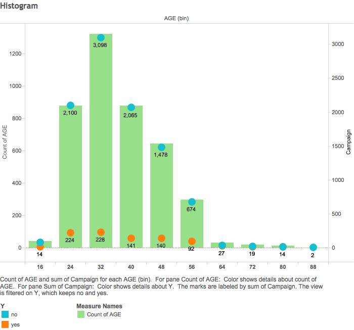
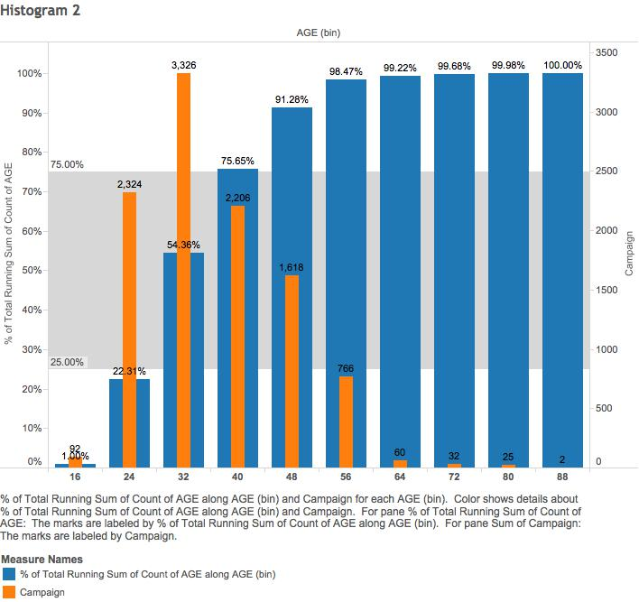
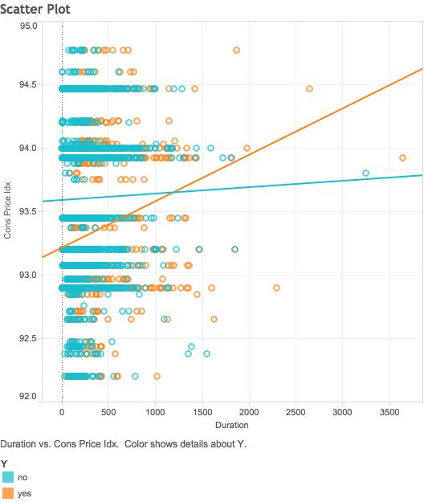
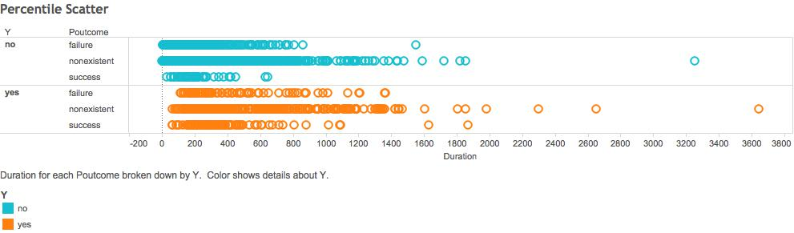
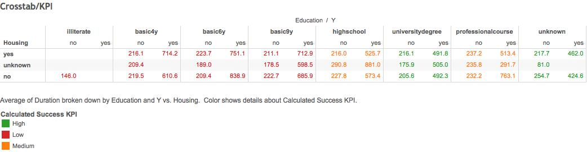
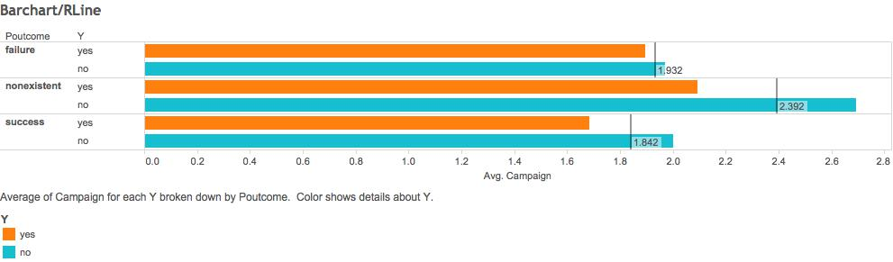
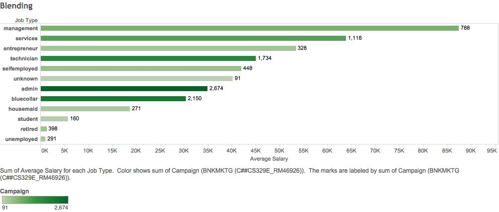
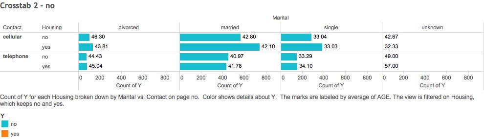
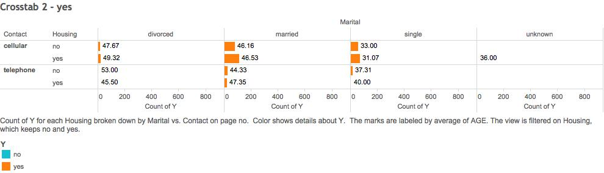

**Authors: Rolando Melendez, Hyunji Seo, Catherine Tu**

##This is how our RStudio is configured:
```{r}
sessionInfo()
```
***
##Program file structure
  00 Doc - contains .Rmd and .html 
  
  01 Data - contains the code to Extract, Transform, and Load our data 
  
  03 Tableau Workbooks - this is where the Tableau workbook(s) goes (twbx format)
  
  04 Shiny - contains our workflows and the code for the visualizations along with code used to create Shiny app.

***

##Explanation of Data:
Our primary data set was gathered from a Portuguese retail bank from 2008 to 2013, in order to "predict the success of telemarketing calls for selling bank long-term deposits" (Moro et al., 2014). Long term deposits are deposits that clients make to set aside a specified amount for an amount of time, during which they are unable to access these resources. The data set was composed of information from bank client, product, and social-economic attributes and whether these bank clients decided to agree to a bank deposit or not.

Citation: [Moro et al., 2014] S. Moro, P. Cortez and P. Rita. A Data-Driven Approach to Predict the Success of Bank Telemarketing. Decision Support Systems, In press, http://dx.doi.org/10.1016/j.dss.2014.03.001

Our second data set comprised of three measures - job type, average salary for that job type, and hours worked per week. This second data set was blended with the first data set by the job type measure.
  
***

##Data summary and subset
```{r}
#Shows the subset and summary of the data frame
source("../01 Data/R_ExtractTransform.R", echo = TRUE)
```
```{r}
#Shows the subset and summary of the data frame
source("../01 Data/R_ExtractTransformJob.R", echo = TRUE)
```
```{r}
source("../01 Data/R_Load.R", echo = TRUE)
```

***

##Label Explanations:
AGE - The age of each marketing participant

JOB - Type of job

MARITAL -  Marital Status

EDUCATION - Level of education reached by participant

DEFAULT - Has this participant defaulted before

HOUSING - Does this participant have a housing loan (Mortgage)

LOAN - Does this participant have a personal loan

CONTACT - Contact communication type (cellular or telephone)

MONTH - Last contact month of the year

DAY OF WEEK - Last contact day of the week

DURATION -  Duration of the last contact to the participant

CAMPAIGN - Number of times this participant was contacted during this campaign

PDAYS - Number of days since participant was last contacted

PREVIOUS - Number of times this participant was contacted before this campaign

POUTCOME - Outcome of previous marketing campaign

EMP VAR RATE - Employment variation rate

CONS PRICE IDX - Consumer price index

CONS CONF IDX - Consumer confidence index

EURIBOR3M - Rate at which banks lend to each other; 3 month loans

NR EMPOLOYED - Number of employees

Y - Outcome, Did the participant subscribe to a term deposit

***

##Non_Aggregated Measures Analysis: 

####Boxplot:
1. From the Analysis tab de-select Aggregate Measures.

2. Select AGE in Measures, Click on Box-and-whisker plot in “Show Me”.

3. Drag EDUCATION from Dimensions onto Rows.

4. Drag Y from Dimensions onto Rows, after EDUCATION.

5. Add EDUCATION to Filter, Filter out “Illiterate” and “Unknown”.



For this first visualizarion we examine the age distribution and outcomes with education levels. The average age of the groups were approximately the same, with the exception of those who had a basic 4 year education and accepted the term deposit
The average age for this group is significantly higher than the average age of other groups.

##Aggregrated Measures Analysis:

####Histogram:

#####The Number of Campaigns By Age Group:
1. Right-click AGE in Measures. Click Create>Bins…. Change the Size of Bins to be 8. Click OK.

2. Drag AGE (bin) to Columns.

3. Drag AGE to Rows. Right click on it, click on Measure, and change to Count.

4. Drag Campaign to Rows. Right click on it, click on Measure, and change to Sum.

5. On the CNT(AGE) Marks area, drag Measure Names to Color. Make sure the type of mark is Bar.

6. On the SUM(Campaign) Marks area, drag Y to Color and drag SUM(Campaign) to Label. Make sure the type of mark is Automatic.

5. Add Y to Filter. Right-click on Y and click “Show Quick Filter”. Make the default filter include both “no” and “yes”.



This graph shows that the distribution of ages of the people targeted by the bank’s marketing campaign is skewed right. The largest age group targeted was those of age 32-39. Despite increased amount of effort, as measured by the number of campaigns, to target the age group of 32-39, the number of campaigns that resulted in a term deposit acceptance was only 4 more than the number of campaigns for the age group of 24-31. Therefore, there was a greater ROI for campaigns to the age group of 24-31.

#####Relative Frequency of Campaigns By Age Group:

1. Using the same AGE (bin) dimension field as the previous histogram, drag AGE (bin) to Columns.

2. Drag AGE to Rows. Right click on it, click on Measure, and change to Count.

3. Drag Campaign to Rows. Right click on it, click on Measure, and change to Sum.

4. Right-click CNT(AGE) in Rows and click Add Table Calculation to the following settings:

*Calculation Type: Running Total*

*Summarize values using: Sum*

*Running along: AGE(bin)*

*Check the box for Perform a secondary calculation on the result*

*Secondary Type: Percent of Total*

*Summarize the values from: AGE (bin)*

*Click OK*

5. In the Marks area for All, add Measure Names to Color.

6. In the Marks area for CNT(AGE), add CNT(AGE) to Label.

7. In the Marks area for SUM(Campaign), add SUM(Campaign) to Label.

8. On the % of Total Running Sum of Count of AGE axis to the left, right-click and choose Add Reference Line with the following settings:

*Reference Band*

*Scope: Entire Table*

*Band From: Constant 0.25*

*Band To: Constant 0.75*



This histogram shows the relative frequency of people in each age group. The reference line shows that the middle 50% of the people targeted by the bank were approximately aged 32 - 47.

##Scatter Plots:

####CPI Scatter Plot:

1. From the Analysis tab de-select Aggregate Measures.

2. Drag DURATION from Measures onto Columns.

3. Drag CONS PRICE IDX from Measures onto Rows.

4. Right Click the Y-Axis and select Edit Axis.

5. Set to a fixed range of 92-95.

6. Drag Y from Dimensions onto Color.

7. From the Analysis tab select Trend Lines>Show Trend Lines.

8. From the Analysis tab select Trend Lines>Edit Trend Lines and uncheck “Show confidence bands”.



To start off, the consumer price index (CONS PRICE IDX)  is the weighted average price of a basket of goods and services for a country. This serves as a price level gauge for the economy as a whole. The Duration (DURATION) is the length of time spent on the last contact with the participants during this campaign.

When Y = No, Rising CPI and longer durations lead us to see a flatter and steady trend of outcomes.

When Y = Yes, Rising CPI and longer durations lead us to see a rising trend in this outcome.

####Duration Percentile Scatter Plot:

1. From the Analysis tab de-select Aggregate Measures.

2. Drag DURATION from Measures onto Columns.

3. Drag Y from Dimensions onto Rows.

4. Drag POUTCOME from Dimensions onto Rows, after Y.

5. Drag Y from Dimensions onto Color.

#####Shiny Steps:
1.  Set up ui.R to include Scatter Plot tab.

2. In the Scatter Plot tab item add a select input for Lower Tail, Upper Tail, and All.

3. Also add two slider inputs. One for the lower tail bound and one for the upper tail bound.

4. Set lower tail bound to minimum of 2 and maximum of 40. Starting value set at 20.

5. Set upper tail bound to minimum of 60 and maximum of 99. Starting value set at 80.

6. Set up server.R for the scatter plot.

7. Set selection filter in if/else to correspond to lower, upper, or all.

8. Use 3 seperate if statements to create a data frame, one filtering only the lower tail, one filtering the upper, and one with no filter showing all data.

9. Plot in ggplot, DURATION on X-Axis, POUTCOME and Y on Y-Axis. Color by Y. Make it a point graph.

10. store this and return.

#####Shiny URL: [https://rmelendez94.shinyapps.io/DV_FinalProject](https://rmelendez94.shinyapps.io/DV_FinalProject)



In this data POUTCOME is the outcome, either success, failure, or unknown, of past marketing. Duration Again is the length of time spent in the last contact with particiants during this campaign. 

As a whole it may seem as though the current outcome of Yes and No are very similar, but upon closer inspection we may see differently.

With the lower tail, such as the lower 20% of data we can see a greater concentration of No. Also within this outcome you can see the larger number of No when a past marketing campaign was a failure as opposed to being successful.

With the upper tail, as we move to a higher and higher percentage of duration we notice that our data has more concentration of Yes than the concentration of No at these levels. Also similarly to the lower tail, there are more past failures than successes.

##Crosstab:

####Relative Success of the Campaign By Customer Segments Divided By Education and Housing Loans:

1. Add Education to Columns.

2. Add Housing to Rows.

3. Add Y to Columns.

4. In the Marks area, add Duration to Label. Right-click on it and change its Measure to Average, if need be.

5. Add a Parameter called “KPI Low Success” with the following settings:

*Data Type: Float*

*Current value: 0.1*

*Allowable values: Range*

*Minimum: 0*

*Maximum: 0.1*

6. Add another Parameter called “KPI Medium Success” with the following settings:

*Data Type: Float*

*Current value: 0.15*

*Allowable values: Range*

*Minimum: 0.1*

*Maximum: 0.15*

7. Create a Calculated Field called “Calculated YES” whose formula is: IF [Y] == 'yes' then 1 ELSE 0 END

8. Create another Calculated Field called “Calculated NO” whose formula is: IF [Y] == 'no' then 1 ELSE 0 END

9. Create another Calculated Field called “Calculated Ratio” whose formula is: WINDOW_SUM(SUM([Calculated YES])/WINDOW_SUM(SUM([Calculated NO])))

10. Create another Calculated Field called “Calculated Success KPI” whose formula is: IF [Calculated Ratio] <= [KPI Low Success] THEN 'Low' ELSEIF [Calculated Ratio] <= [KPI Medium Success] THEN 'Medium' ELSE 'High' END

11. In the Marks area, drag Calculated Success KPI to Color. In the AGG(Calculated Success KPI) area, change the color of High to Green, the color of Medium to Orange and the color of Low to Red.

#####Shiny Steps:
1. Set up ui.R to include Crosstab tab.

2. In the Crosstab tab item, add slider input for determining the maximum value of the lower KPI and the minimum value of the higher KPI.

3. Set up server.R for the crosstab.

4. Use the slider input as values to mutate data in the dataframe into KPI categories.

5. Plot in ggplot -- X-Axis -->Y; Y-Axis -> HOUSING. Label with AVG_DURATION. Fill by KPI.

#####Shiny URL: [https://rmelendez94.shinyapps.io/DV_FinalProject](https://rmelendez94.shinyapps.io/DV_FinalProject)



This crosstab compares the average call duration across target market groups sectioned by education level (Education) and whether or not they have a housing loan (Housing). It also further categorized the market segment groups by a key performance indicator: the ratio of campaign successes to campaign failures in those of the same education level (Calculated Success KPI). Campaign success is defined as when they accepted a term deposit (Y) offer as a result of the campaign. A ‘High’ rating in the KPI indicated that the ratio of successes to failures exceeded 15%. A ‘Low’ rating indicated the ratio of successes to failures was less than 10%. This KPI rating also helps showcase which education level group the bank had more success in persuading.

We found that the bank generally found higher success rates when contacting people of higher education levels. Of the people who accepted the term deposit offer, the groups that had a higher education level had a lower average call duration than those with a lower education level. Meanwhile, the market segments of elementary and junior high graduates had longer average call durations. If the bank were to continue the campaign, we would suggest for them to spend more time and effort persuading people of higher education levels, as each second of a telemarketing call is more significant in bringing these people to a decision.

##Barcharts:

####Number of Campaigns by Past and Current Outcome:

1. Drag CAMPAIGN to Columns

2. Change SUM(CAMPAIGN) to AVG(CAMPAIGN)

3. Drag POUTCOME to Rows

4. Drag Y to Rows, after POUTCOME

5. Sort Y in Rows -- Sort order -> Descending; Sort by -> Alphabetic

6. Drag Y to Color

7. Right click the X-axis and select “Add Reference Line”

8. In this window, select Label -> “Value”

9. Right click the X-axis and select “Add Reference Line”

10. In this window, select Value -> “AVG(CAMPAIGN); Sum” and Label -> “Value”



In this visualization we observed the number of times each person was contacted in the current cmpaign (CAMPAIGN), past campaign outcome (POUTCOME), and current campaign outcome (Y).

We found that for those who had previously declined taking a long-term bank deposit, there was a small difference in the average number of campaigns between those who accepted or declined the bank deposit for this current bank marketing. For those who had previously accepted taking a long-term bank deposit, there was a greater difference in the average number of campaigns between those who accepted or declined the bank deposit for this current bank marketing. 

####Average Salary and Campaigns by Job Type:
*Also demonstrates data blending*

1. Select JOBTYPE Data

2. Drag AVERAGE SALARY to Columns (aggregated sum value)

3. Drag JOB TYPE to Rows

4. Drag Measure Names to Filters

5. Select BNKMKTG Data

6. Drag CAMPAIGN to Color

7. Drag CAMPAIGN to Label

8. Sort JOB TYPE

9. Select Sort Order -> Descending; Sort by Field -> Average Salary

#####Shiny Steps:
1. Set up ui.R to include Bar Plot tab.

2. In the Bar Plot tab item add radio buttons input for sorting by average salary or number of campaigns.

3. Set up server.R for the scatter plot.

4. Set selection filter in if/else to correspond to job type or number of campaigns.

8. Use 2 if statements to create a data frame, one sorting average salary by job type or number of campaigns.

9. Plot in ggplot -- X-Axis -> JOB TYPE; Y-Axis -> AVERAGE SALARY. Fill by CAMPAIGN. Set it to be a bar graph.

#####Shiny URL: [https://rmelendez94.shinyapps.io/DV_FinalProject](https://rmelendez94.shinyapps.io/DV_FinalProject)



For this visualization, we blended two data sets - job-type and bank-additional - and extracted the relationship between the variables JOB TYPE, CAMPAIGN, and AVERAGE SALARY. We used JOB TYPE as the common variable between the two data sets, and created a relationship in Tableau through JOB TYPE. The CAMPAIGN variable represented the number of contacts performed during the current marketing campaign for a specific client, while the AVERAGE SALARY represented the annual salary of clients, given by job types.

From the Shiny application, we can observe that the trend in the average number of campaigns performed is not necessarily the same as the trend in average salary for each job type. The “management” job type clearly has the highest salary, but it is “administration” that is associated with the greatest number of campaigns per job type. However (excluding unknown), “student, housemaid, and unemployed” were in the lowest 4 job types whether sorted by average salary or number of campaigns.

####Success of Campaigns Segmented By Contact Method, Housing Loan Status, and Marital Status:

1. Add Marital to Columns.

2. Add Contact to Rows.

3. Add Housing to Rows.

4. Add Y to Columns. Right-click it and change its data type to be Measure>Count.

5. In the Marks area, add Y to Color and AGE to Label. Right-click AGE and change its Measure to Average, if need be.

6. Add Housing to Filters. Allow only “no” and “yes” from the filter list.

7. Add Y to Pages.





This graph shows that when dividing its customer market by marital status, housing loan status and contact method, the top 2 largest groups were those who are married, have housing loans  and were contacted by cellular numbers, and those who are married, do not have housing and were contacted by cellular numbers. In all groups including married people, the average age of those who accepted the term deposit is at least approximately 4 years higher than the average age of those who did not accept the term deposit. The same increase in average age between those who accepted and those who did not accept can be seen in all of the other customer groups, but most were not as significant of difference as that in the married group.
